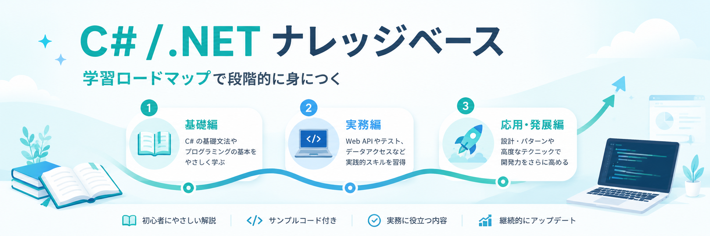

# C# / .NET ナレッジベース



このリポジトリは MkDocs / Material for MkDocs で静的サイト化する C# / .NET 学習ナレッジベースです。

公開用の記事は [docs/index.md](docs/index.md) から始まります。レビュー、ファクトチェック、アーカイブなどの管理記録は `作業/` に残し、サイトのナビゲーションには含めません。

## 公開サイト

https://t-shirayama.github.io/csharp-tutorial-lab/

## ローカル表示

ローカル環境を汚さないため、Python や MkDocs は Docker container 内で実行します。
事前に Docker Desktop を起動しておきます。

```powershell
docker compose up --build
```

ブラウザで `http://127.0.0.1:8000/` を開きます。

## ビルド

```powershell
docker compose run --rm docs mkdocs build --clean
```

CI と同じ厳格な条件で確認する場合は次を実行します。

```powershell
docker compose run --rm docs mkdocs build --clean --strict
```

生成物は `site/` に出力されます。

## 依存関係

`requirements.txt` は人間が編集する直接依存の入力ファイルです。Docker と CI は、推移的依存まで固定した `requirements.lock` を使います。

依存を更新したら、Dockerfile と同じ Python 3.14 slim image で lock file を再生成します。

```powershell
docker compose run --rm lock
```

ドキュメント構造の同期漏れは次で確認できます。

```powershell
docker compose run --rm docs python scripts/validate_docs.py
```

コンテナを停止する場合は次を実行します。

```powershell
docker compose down
```

## セキュリティ対策

このリポジトリでは、ドキュメントサイトそのものだけでなく、依存関係、GitHub Actions、Dockerfile、秘密情報の混入を CI で継続的に確認します。

- [Dependabot](.github/dependabot.yml) で GitHub Actions、Python 依存、Docker、Docker Compose の更新を監視します。
- Dependabot が作る PR は `develop` 宛にし、`main` へは `develop` からレビュー済み PR で反映します。
- [Security checks](.github/workflows/security.yml) で MkDocs の strict build、Dependency Review、GitHub Actions workflow の静的解析、secret scan、Dockerfile lint を実行します。
- [CodeQL](.github/workflows/codeql.yml) で GitHub Actions workflow 定義を code scanning にかけます。
- [OpenSSF Scorecard](.github/workflows/scorecard.yml) で `main` の supply chain security の状態を定期確認し、結果を code scanning にアップロードします。
- [CODEOWNERS](.github/CODEOWNERS) で全ファイルの所有者を明示します。
- [SECURITY.md](SECURITY.md) で脆弱性報告の扱いと CI セキュリティ対策を明記します。
- Docker base image と Python 依存は固定し、Dependabot で更新 PR を作ります。
- 各 workflow では、可能な限り `GITHUB_TOKEN` の権限を最小化し、`actions/checkout` の credential 永続化を無効にします。

GitHub 側では、`Settings` → `Code security and analysis` で secret scanning と push protection を有効化し、`Rulesets` または branch protection で主要な security check を必須にします。

## ブランチ運用

- `develop`: Dependabot や通常変更の PR 先。CI で security check と CodeQL を確認します。
- `main`: GitHub Pages の公開元。`develop` から PR で取り込み、直接 push しません。
